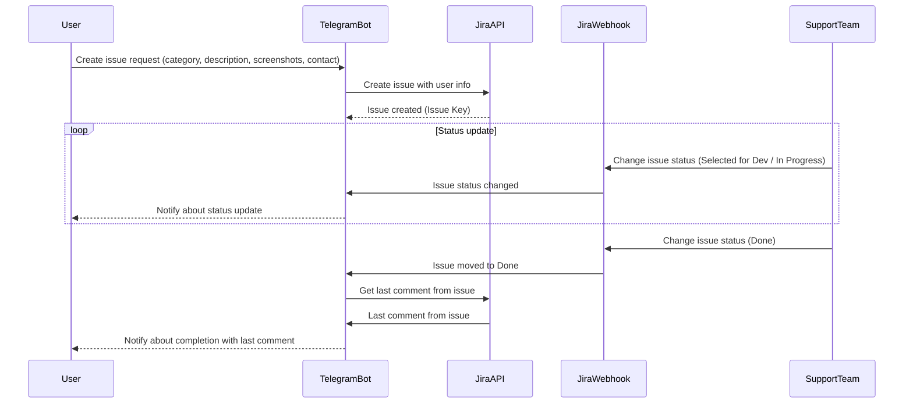

# Telegram Helpdesk Bot for Jira | Telegram бот техподдержки

**EN:** This bot is built with **Python 3.10** and the [**Aiogram 3**](https://github.com/aiogram/aiogram) framework. 
It provides a simple helpdesk workflow through a Telegram bot and seamlessly integrates with **Jira Server**.  

**RU:** Этот бот разработан на **Python 3.10** с использованием фреймворка [**Aiogram 3**](https://github.com/aiogram/aiogram).  
Он предоставляет простой процесс работы службы поддержки через Telegram-бота и легко интегрируется с **Jira Server**.

## Why? | Зачем?

**EN:** The goal was straightforward: **receive issues via Telegram and automate their creation and updates in Jira**. 
However, after researching existing solutions, I found none that fully met my needs.  

- Some were **proprietary** and overloaded with unnecessary features.  
- Others focused on **live chat** (such as the excellent [Telegram Support Bot](https://github.com/bostrot/telegram-support-bot)).  

Since no existing tool fit my use case, I decided to build my own.  

If you find this bot useful, feel free to contribute—**pull requests are welcome!**  
  
**RU:** Цель была проста: **принимать заявки через Telegram и автоматизировать их создание и обновление в Jira**.  
Однако, изучив существующие решения, я не нашел ни одного, которое бы полностью соответствовало моим требованиям.  

- Некоторые были **закрытыми** и перегруженными ненужными функциями.  
- Другие были ориентированы на **живой чат** (например, отличный [Telegram Support Bot](https://github.com/bostrot/telegram-support-bot)).  

Поскольку ни один из существующих инструментов не подошел под мой кейс, я решил создать свой собственный.  

Если этот бот оказался для вас полезным, не стесняйтесь вносить вклад — **pull-реквесты приветствуются!**

## Workflow | Схема работы



## Features | Функционал

**EN:**  
- [Basic logic] Ask the user about problems, gather info (Category, Description, Screenshots, Contact information)
- [Basic logic] Creates issues with Jira REST API
- [Basic logic] Notifies user about issue status updates with Jira webhooks
- [Basic logic] Deliver the last issue comment with Jira REST API, when the issue updates to "Done" status
- Full i18n support EN/RU (language will be detected automatically, which is not good tbh)
- The user can list all his issues that currently are not in "Done" status
  
**RU:**  
- [Базовая логика] Спрашивает пользователя о проблеме, собирает информацию (Категория, Описание, Скриншоты, Контактные данные)  
- [Базовая логика] Создает задачи через Jira REST API  
- [Базовая логика] Уведомляет пользователя об изменении статуса задачи через Jira webhooks  
- [Базовая логика] Отправляет последний комментарий к задаче через Jira REST API, когда ее статус меняется на "Done"  
- Полная поддержка i18n EN/RU (язык определяется автоматически, что не очень хорошо, если честно)  
- Пользователь может просмотреть список всех своих задач, которые еще не находятся в статусе "Done"

## Setup | Установка

**EN:**  
1. Clone repo
2. Create .env file and put your Telegram Bot token and Jira credentials listed in example.env
3. Bot is in webhook mode, so you will need a domain, vscode ports works pretty good for development reasons. I use Let's Encrypt certificates and actual domain
4. Create a webhook on issues update in Jira admin settings
5. Configure settings.py in the root folder to your needs
6. ```make setup```
9. ```make start```
10. Bot uses sqlite database, so there is no need in database setup/migrating etc.
  
**RU:**  
1. Клонируйте репозиторий  
2. Создайте файл `.env` и укажите в нем токен Telegram-бота и учетные данные Jira, как в `example.env`  
3. Бот работает в режиме webhook, поэтому потребуется домен. Порты VS Code отлично подходят для разработки. Я использую сертификаты Let's Encrypt и реальный домен  
4. Создайте webhook на обновление задач в настройках администратора Jira  
5. Настройте `settings.py` в корневой папке в соответствии с вашими потребностями  
6. ```make setup```  
7. ```make start```  
8. Бот использует базу данных SQLite, поэтому настройка/миграция базы данных не требуется

## Sources
[Aiogram 3 Docs](https://docs.aiogram.dev/)  
[About Jira authentification](https://developer.atlassian.com/server/jira/platform/cookie-based-authentication/)  
[Jira REST API Docs 9.12.9](https://docs.atlassian.com/software/jira/docs/api/REST/9.12.9/)
